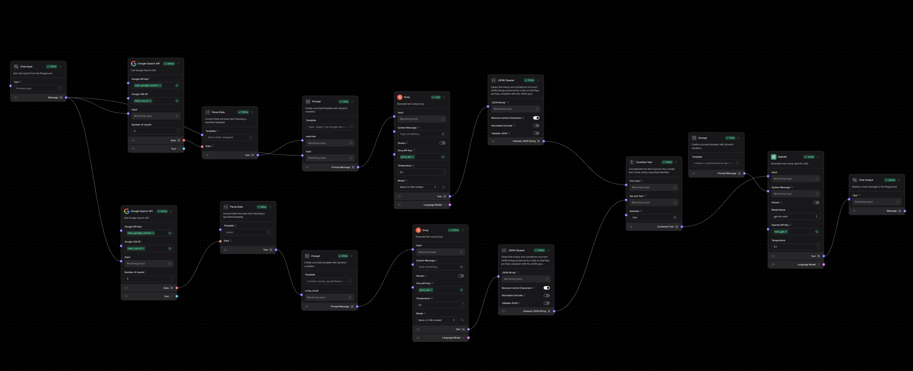

# Automated Research and Trigger Finder (ART Finder)

## Objective
The **Automated Research and Trigger Finder (ART Finder)** aims to revolutionize the research phase of ad creation by automating data gathering and analysis. This chatbot-based system enables marketers to:

- Identify user pain points and triggers by scraping data using the Google Search API.
- Analyze competitor strategies to uncover high-performing hooks, CTAs, and content formats.
- Generate actionable insights and suggestions to craft effective, user-centric ads.

---

## Key Features

### 1. Comprehensive Research Automation
- **Data Gathering:**
  - Scrapes data from Google Search API for blogs, forums, and other relevant sources.
- **Trend Identification:** Highlights emerging topics and user concerns.

### 2. Actionable Insights Generation
- **Trigger and Problem Identification:** Summarizes key user pain points and motivations.
- **Ad Content Suggestions:** Recommends high-performing hooks, CTAs, and solutions tailored to specific topics and audiences.

### 3. User-Centric Interface
- **Input Simplicity:** Easy-to-use fields for entering topics and brand guidelines.
- **Insightful Output:** The chatbot provides insights and recommendations directly via the interface.

---

## Flow Diagram
Below is the LangFlow data flow diagram used in the backend development:

---

## Technical Stack

- **Backend:**
  - Developed using [LangFlow](https://github.com/logspace-ai/langflow).
  - Utilizes **GROQ** queries for efficient data retrieval.
  - Leverages **GPT LLM API keys** for advanced language processing.

- **Frontend:**
  - Built with **Next.js** for a responsive and interactive user interface.

---

## How It Works
1. **Input Phase:** Users provide the topic and brand guidelines through a simple input field.
2. **Data Collection:** The system gathers data using the Google Search API.
3. **Analysis:** Extracted data is analyzed to identify user pain points, triggers, and successful ad elements.
4. **Output:** Recommendations and references are provided for crafting user-centric, effective ads.

---

## Contact
MISSION_I_M_POSSIBLE
Mayank Gongal
Ketan Baitule
Gaurav Bijwe
Tejas Keshwani

